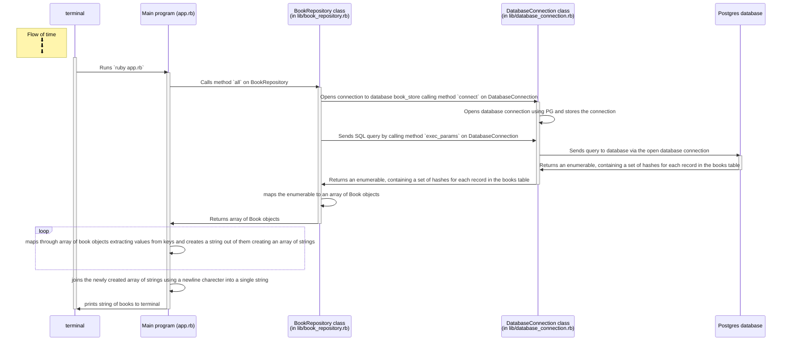

```mermaid 
%%{init: { 'theme':'dark',"sequence": {
      "mirrorActors": true,
      "wrap": true
      "actorFontSize":16
    } } }%%
sequenceDiagram

participant t as terminal
    participant app as Main program (app.rb)
    participant br as BookRepository class <br /> (in lib/book_repository.rb)
    participant db_conn as DatabaseConnection class <br /> (in lib/database_connection.rb)
    participant db as Postgres database

    Note left of t: Flow of time <br />⬇ <br /> ⬇ <br /> ⬇ 
    activate t
    t->>app: Runs `ruby app.rb`
       activate app
    app->>br: Calls method `all` on BookRepository
        activate br
    br->>db_conn: Opens connection to database book_store calling method `connect` on DatabaseConnection
   activate db_conn
    db_conn->>db_conn: Opens database connection using PG and stores the connection 
    br->>db_conn: Sends SQL query by calling method `exec_params` on DatabaseConnection
    db_conn->>db: Sends query to database via the open database connection
       activate db
    db->>db_conn: Returns an enumerable, containing a set of hashes for each record in the books table
     deactivate db
    db_conn->>br: Returns an enumerable, containing a set of hashes for each record in the books table
        deactivate db_conn
    br->>br: maps the enumerable to an array of Book objects
    br->>app: Returns array of Book objects
     deactivate br
        loop
     app->>app: maps through array of book objects extracting values from keys and creates a string out of them creating an array of strings
        end
     app->>app: joins the newly created array of strings using a newline charecter into a single string
     app->>t: prints string of books to terminal
     deactivate app
     deactivate t
```